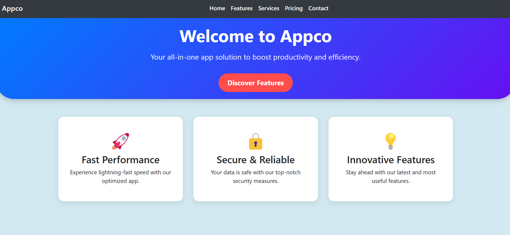
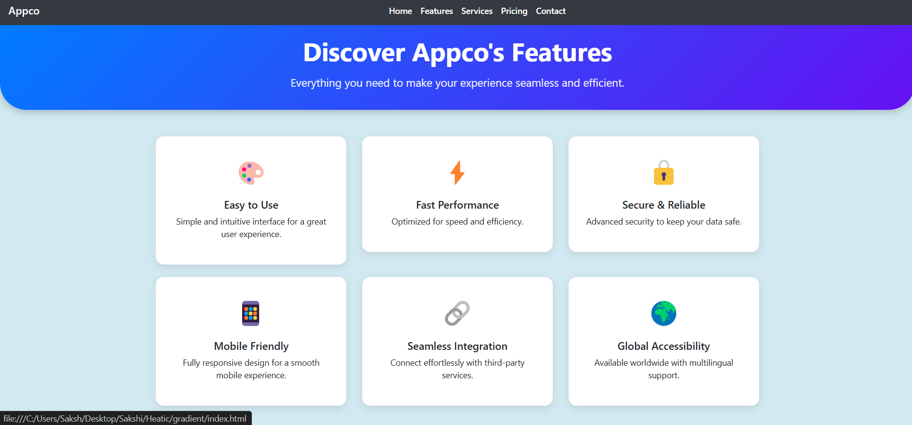
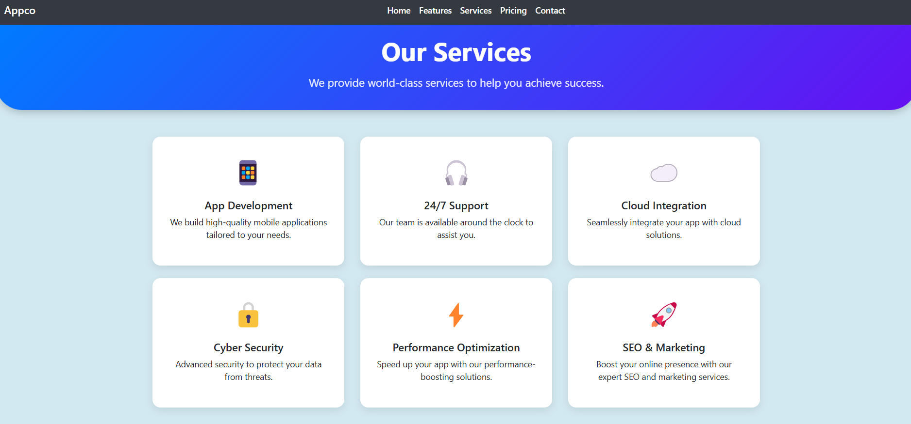
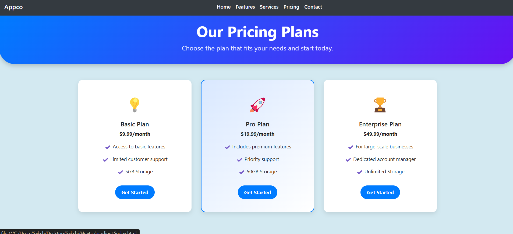
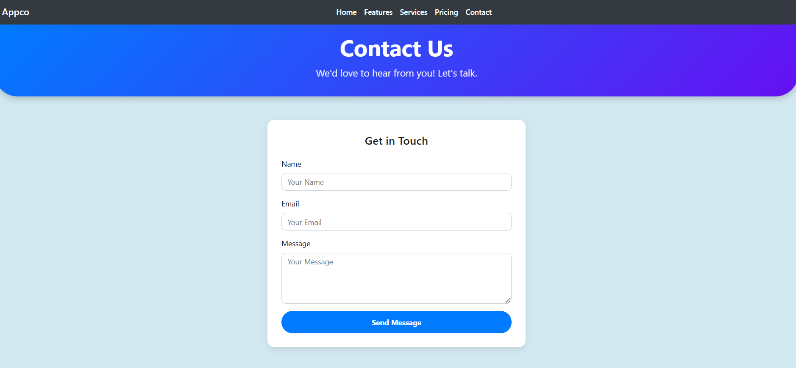

# 🚀 Appco - Modern Business Website

## 🌟 Overview
Appco is a **responsive and modern business website** built with **Bootstrap 4.6**, designed for startups, tech businesses, and SaaS companies. It includes essential pages like **Home, Features, Services, Pricing, and Contact**, providing a complete online presence for businesses.

This project is **fully responsive**, ensuring a seamless experience on desktops, tablets, and mobile devices.

---

## 🔥 Features

✅ **Responsive Design** – Mobile-friendly & optimized for all devices  
✅ **Bootstrap 4.6** – Fast and scalable UI components  
✅ **Modern UI/UX** – Clean layout and smooth animations  
✅ **Fully Customizable** – Easy to modify for any business needs  
✅ **Contact Form** – Engaging and easy-to-use contact section  
✅ **Pricing Section** – Well-structured pricing plans  
✅ **Service Section** – Highlights key offerings professionally  
✅ **Social Media Integration** – Quick links to major platforms  

---

## 📸 Screenshots  

### Home Page  
 

### Features Page  
 

### Services Page  
   

### Pricing Page  
   

### Contact Page  
  

---

## 🚀 How to Run

1️⃣ **Clone the repository:**  
```sh
 git clone https://github.com/Sakshi-2508/Appco
```

2️⃣ **Navigate to the project directory:**  
```sh
 cd appco
```

3️⃣ **Open `index.html` in your favorite browser or run a local server:**  
```sh
 python -m http.server 8000
```

4️⃣ **Visit [GitHub Repository](https://github.com/Sakshi-2508/Appco) to explore Appco! 🎉**

---

## 🛠️ Tech Stack  

- **Frontend:** HTML5, CSS3, Bootstrap 4.6  
- **Icons:** Font Awesome  
- **Animations:** CSS hover effects & transitions  
- **Hosting:** GitHub Pages (or any static hosting service)  

---

## 👨‍💻 Contributing

Feel free to **fork** this repository and contribute! PRs are always welcome. 😊

---

## 📝 License

This project is **open-source** and available under the **MIT License**.

---

### 🎉 Made with ❤️ by [Sakshi](https://github.com/Sakshi-2508)